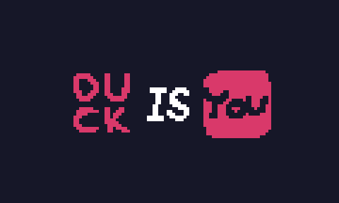
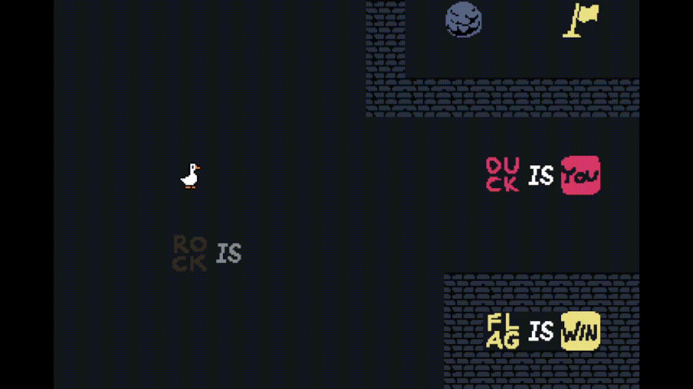
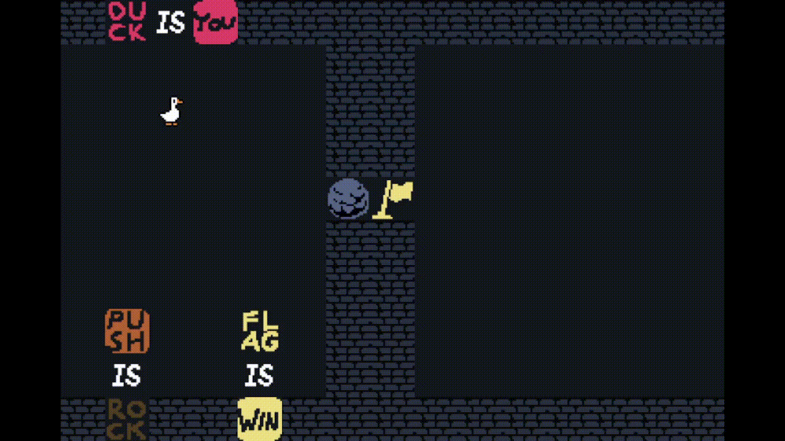
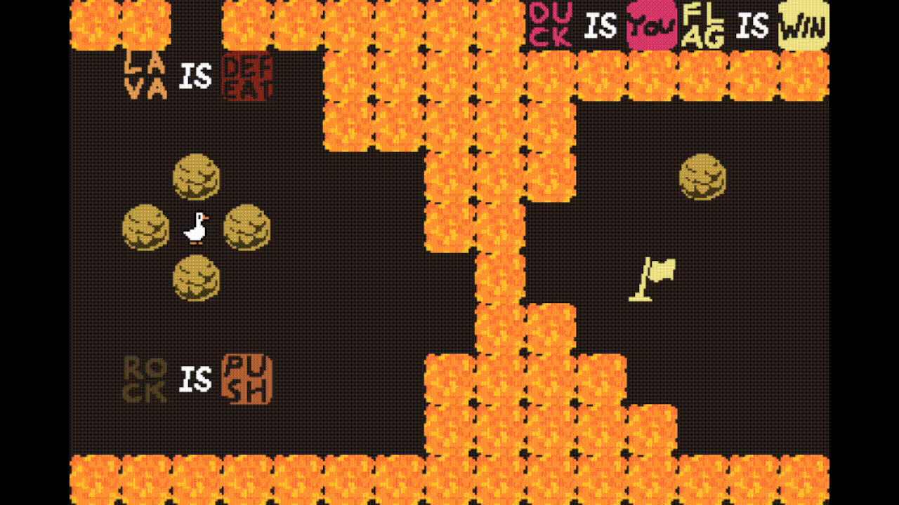
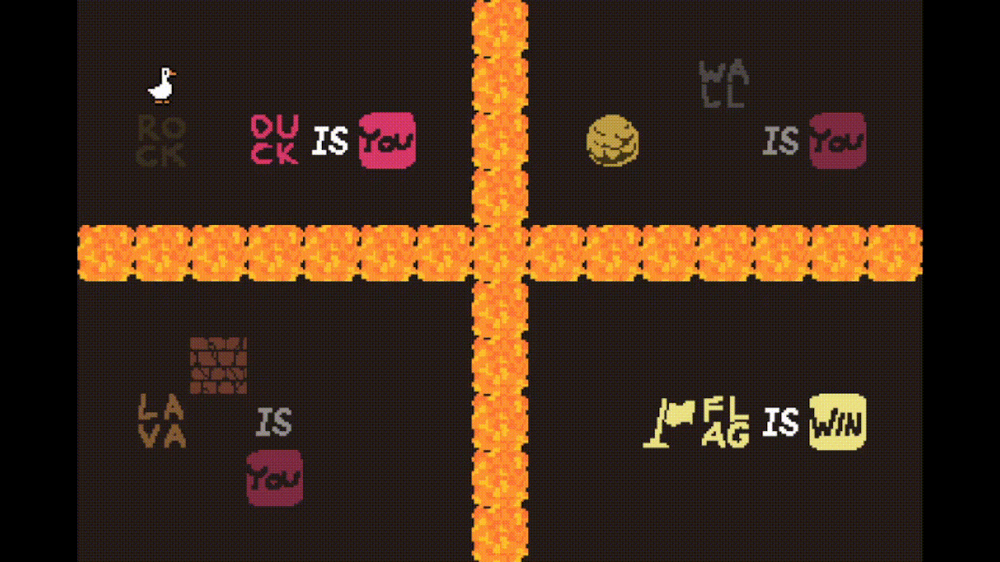
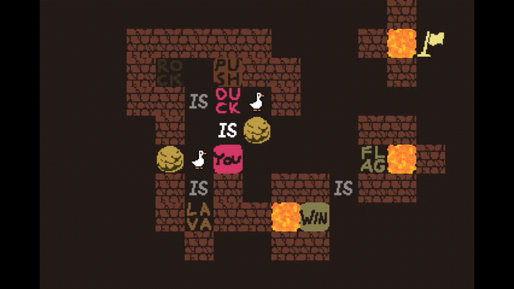
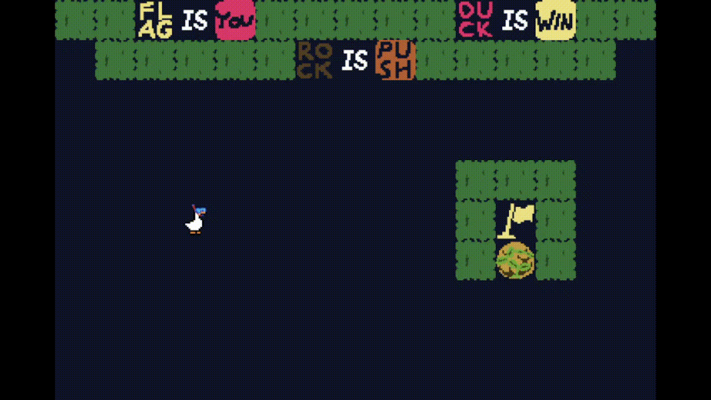
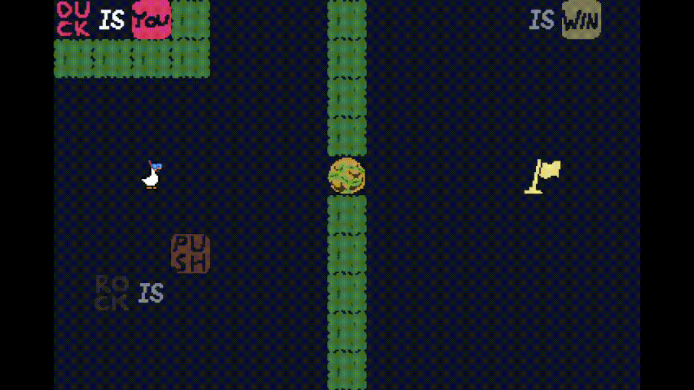
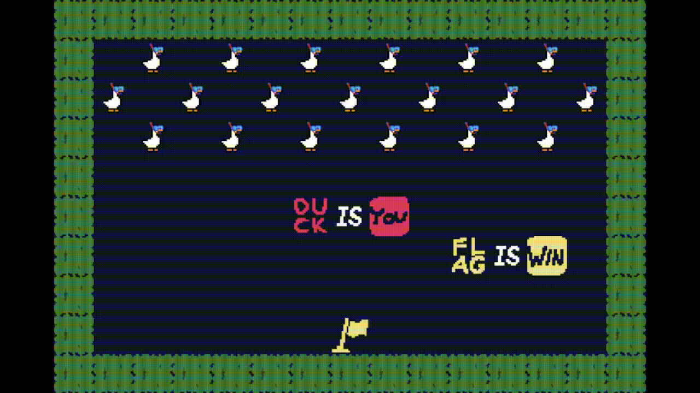

# DUCK IS YOU

## Présentation du jeu :
Puzzle Game reprenant le concept de "Baba is you"

Contrôles :
<li>←↑→↓ : se déplacer</li>
<li>r : réanitialiser le niveau</li>
 
But du jeu :
Atteindre le drapeau (?)

  

# Solutions :

## Monde 1

### Niveau 1 : The ugly duckling

`→ ↓ ↓ ↑ ↑ → → → → → ↓ → → ↑ → → `

### Niveau 2 : To be or not to be

`← ↓ ↓ ↓ → ↑ ← ↑ → → → → → → → → → ↓ → → → ↑`

### Niveau 3 : A tricky one

`→ → → ↓ ↓ ↓ ↓ ↓ ← ← ↑ ← ↓ ↑ ↑ ↑ → → → → → → ↑ → → → ↓ ← ← ← ← ← ← ← ← ↓ ← ← ← ↓ ↓ ↓ → ↑ → ↑ ↑ ↑`

## Monde 2

### Niveau 1 : Roast duck

`→ → ↑ ↑ ↑ ← ↓ ← ↑ → → ↓ ↓ ↓ ↓ ↓ ↓ ↓ ← ↑ ↑ ↑ ↑ ↑ ↑ → ↑ ← ↓ ↓ ↓ ↓ ↓ → → → → → → → → ↑`

### Niveau 2 : What the hell ?

`← ↓ ↓ → ↑ ← ↑ → → → ↑ ↑ → → ↓ ← ← ↓ → ↓ ↓ ↓`

### Niveau 3 : Konami code 

`↑ ↑ ↓ ↓ ← → ← →`

## Monde 3

### Niveau 1 : Something went wrong

`↓ ↓ ← ← ← ← ← ← ← ← ↑ ↑`

### Niveau 2 : Something is missing ?

`→ ↓ ↓ ↑ ↑ → → → → → → ← ← ← ← ← ← ← ← ← ↓ ↓ ↓ ↓ → ↑ ↑ ↑ ← ↑ → → → → → → → → ↓ → ↑ ↑ ↑ ↑ ← ↑ → → ↓ ↓ ↓ ↓`

### Niveau 3 : What the duck ?

`← → → → → → ← ↑ ↓ ↓ ← ← ← ← ↑ → → → → ↓ ↓ ↓ ↓ ↓`