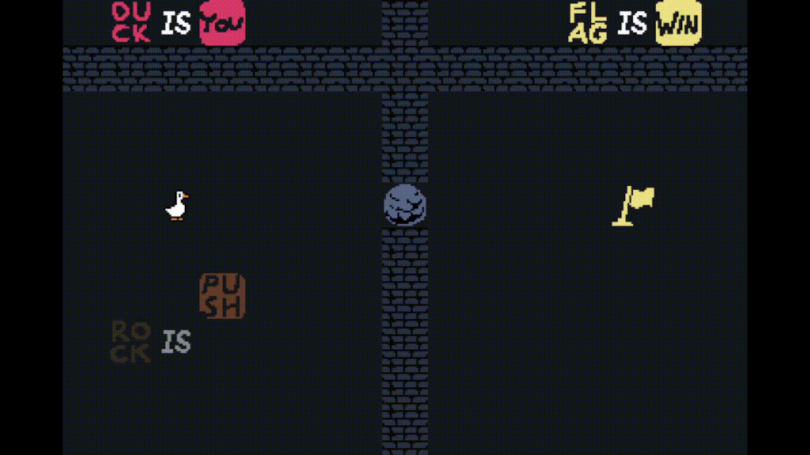

# DUCK IS YOU

## Sommaire :
[I - Installation](#installation)  
[II - Présentation du jeu](#présentation-du-jeu)  
[III - Architecture du projet](#architecture-du-projet)  
[IV - Solutions](#solutions)  

# Installation
JDK : corretto-17 
JUnit : junit 5
  
# Présentation du jeu
Puzzle Game reprenant le concept de "Baba is you"

Contrôles :
<li>←↑→↓ : se déplacer</li>
<li>r : réanitialiser le niveau</li>
 
But du jeu :
Atteindre le drapeau (?)

  

# Architecture du projet

## Diagramme de classe

Voici le diagramme UML du projet :

## Définitions :

### <b>Présentation des GameObjects</b>

<b>Sprite</b>  
Les Sprites sont les gameObjects dont le comportement peut évoluer en cours de jeu, l'image d'un sprite de même type peut varier en fonction du biome.</li>
  
<b>Block</b>  
Les blocks sont les objects que le joueurs manipule pour modifier les règles du jeu. Il en existe trois sous-types :
    <li>BlockSubject : détermine le sprite concerné</li>
    <li>BlockIs</li>
    <li>BlockAction : détermine le comportement adopté</li>

  

## Factory

Contrairement aux Sprites, les blocks ont toujours la même image en fonction de leur type.
Une factory permet de simplifier leur instanciation.

Cette factory est particulière : la méthode createBlock() est surchargé pour instancier automatiquement le bon block en fonction du type passé en paramètre.
Si l'on souhaite ajouter d'un nouveau block (de type subject ou action), il suffit de modifier la méthode du type correspondant.

 

## Builder

Les niveaux sont séparés entre plusieurs biomes changeant les sprites disponibles ainsi que l'apparence de certains sprites.
Le pattern builder permet différents types de générations en fonction d'un fichier donné en paramètre.

Au lieu d'instancier le LevelDirector en lui passant le type de LevelBuilder en paramètre, on lui fournit directement le fichier `.duck` du niveau.
Le LevelDirector determine ensuite le Builder approprié en fonction des paramètres fournis par le `.duck`.
En faisant ainsi on élimine la répétition du code de la lecture du fichier.
Le builder permet de faciliter la gestion des biomes, à l'ajout d'un nouveau biome, un builder associé devra être créé et celui-ci ajouté dans une nouvelle conditionelle du LevelDirector.

 

## Observer

Afin de mettre à jour le comportement des sprites en fonctions des règles établies par les blocks, on utilise le pattern observer.
Lors de l'ajout à la carte, tous les sprites (sujets concrets) sont ajoutés à un observer associé à leur type.
Lorsqu'une règle d'un type est mise à jour, l'observer change son comportement et notifie la modification aux sprites.

Ce pattern permet de gérer automatiquement les modifications de comportement de tous les sprites du niveau.
A l'ajout d'un nouveau sprite ou comportement, aucune modification de code n'est nécessaire concernant le changement de comportement.

  

# Solutions

## Monde 1

### Niveau 1 : The ugly duckling

`→ ↓ ↓ ↑ ↑ → → → → → ↓ → → ↑ → → `

### Niveau 2 : To be or not to be

`← ↓ ↓ ↓ → ↑ ← ↑ → → → → → → → → → ↓ → → → ↑`

### Niveau 3 : A tricky one

`→ → → ↓ ↓ ↓ ↓ ↓ ← ← ↑ ← ↓ ↑ ↑ ↑ → → → → → → ↑ → → → ↓ ← ← ← ← ← ← ← ← ↓ ← ← ← ↓ ↓ ↓ → ↑ → ↑ ↑ ↑`

## Monde 2

### Niveau 1 : Roast duck

`→ → ↑ ↑ ↑ ← ↓ ← ↑ → → ↓ ↓ ↓ ↓ ↓ ↓ ↓ ← ↑ ↑ ↑ ↑ ↑ ↑ → ↑ ← ↓ ↓ ↓ ↓ ↓ → → → → → → → → ↑`

### Niveau 2 : What the hell ?

`← ↓ ↓ → ↑ ← ↑ → → → ↑ ↑ → → ↓ ← ← ↓ → ↓ ↓ ↓`

### Niveau 3 : Konami code 

`↑ ↑ ↓ ↓ ← → ← →`

## Monde 3

### Niveau 1 : Something went wrong

`↓ ↓ ← ← ← ← ← ← ← ← ↑ ↑`

### Niveau 2 : Something is missing ?

`→ ↓ ↓ ↑ ↑ → → → → → → ← ← ← ← ← ← ← ← ← ↓ ↓ ↓ ↓ → ↑ ↑ ↑ ← ↑ → → → → → → → → ↓ → ↑ ↑ ↑ ↑ ← ↑ → → ↓ ↓ ↓ ↓`

### Niveau 3 : What the duck ?

`← → → → → → ← ↑ ↓ ↓ ← ← ← ← ↑ → → → → ↓ ↓ ↓ ↓ ↓`